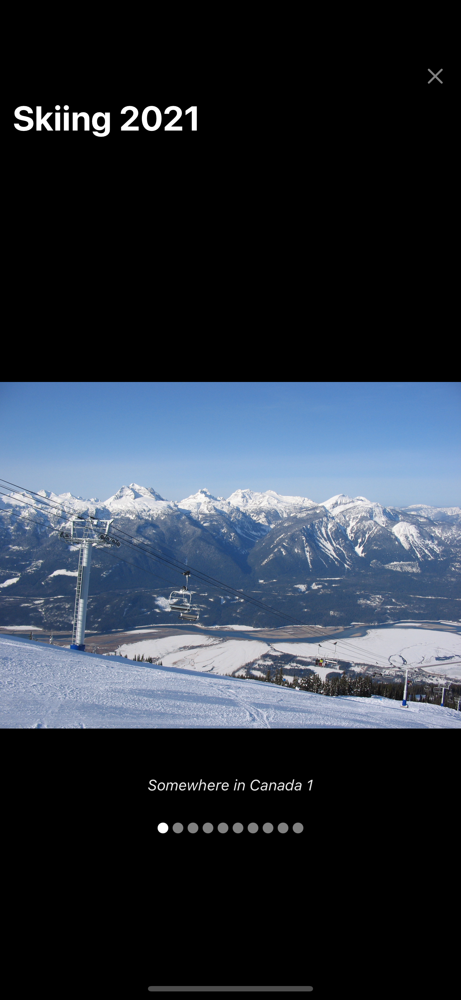

# Memwa Take home Task

## About

The project uses an expo typescript starter with the new file-based routing
system developed by expo.

To Run the project use `yarn start` to start an expo development server.

the project is formatted using prettier.

## Testing

Testing has been provided with Jest. To run the tests in this project use
`yarn test` to run all test suites.

## Considerations made in the project

I have not provided extensive testing to all components but given more time I
would like to explore more network edge cases in which only partial images are
loaded from a set. The business behavior here would be interesting to know as
it would guide UX on what we want to show to the user.

## Future Ideas

Given more time, I would like to implement a Memory over page which would
have the memories displayed in some format such as a card. This card would have

On the technical side, I would look at preloading the images before the user
clicks on viewing that Memory. My idea would be to prefetch the first image of a
memory that would initially be displayed and then during the interval prefetch
the next one.

I would also like to spend more time refactoring the UI system and components so
that they are as stateless as possible. For stateful ones, I would also add
testing to ensure that they're always consistent.

## Screenshots

